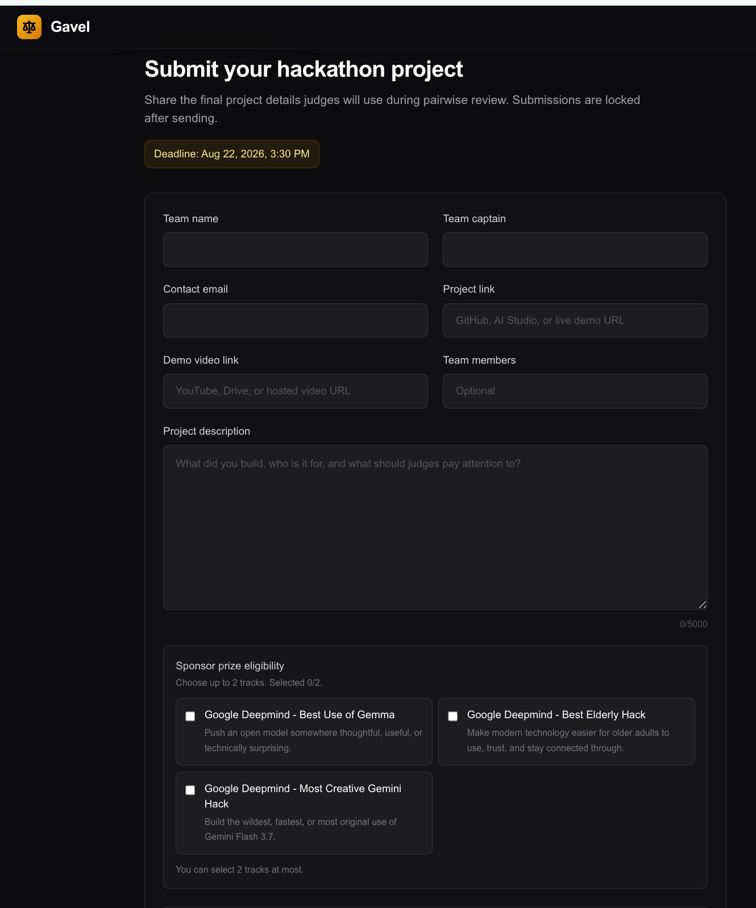

# Agrim Tycoon — Gavel Submission

## Paste into Gavel

| Gavel field | Submission value |
| --- | --- |
| **Team name** | Agrim Tycoon |
| **Team captain** | Sayyid Khan |
| **Contact email** | sayyidkhan92@hotmail.com |
| **Project link** | https://github.com/sayyidkhan/agrim-tycoon |
| **Demo video link** | `TBD — add the public or unlisted video URL before submitting (maximum 3 minutes).` |
| **Team members** | Sayyid Khan |
| **Sponsor prize eligibility** | **Google DeepMind — Best Use of Gemma** |

### Project description

Agrim Tycoon is a city-management game where you become mayor of Innovation City and balance three competing worlds: AI mission systems, the 65labs community, and Code With AI’s next generation of builders. Every scenario forces a trade-off between speed, public trust, human oversight, and energy.

Gemma is the local chief of staff inside the game. It runs on-device through a bundled `llama.cpp` runtime, triaging incidents and simulating the “Elon arrives” plot twist as structured recommendations, narratives, and stat changes. Players can act on or challenge its recommendation, so Gemma materially changes the game loop rather than sitting beside it as a chatbot. The desktop build remains playable offline, with an explicit deterministic fallback if the local runtime is unavailable.

Judges should play the SpaceXAI “Elon arrives” scenario and delegate it to Gemma. The result visibly shifts civic control, community trust, alignment, and the next decision in the city.

## Submission details and proof

- **Project name:** Agrim Tycoon
- **Repository:** [github.com/sayyidkhan/agrim-tycoon](https://github.com/sayyidkhan/agrim-tycoon)
- **Track:** Best Use of Gemma
- **Gemma proof:** a bundled local GGUF model, served by `llama.cpp`, returns structured incident triage and the Elon scenario branch.
- **Demo video:** `TBD`

## Three-minute demo outline

| Time | Show | What judges should see |
| --- | --- | --- |
| 0:00–0:20 | Landing page and premise | “Build the city. Tame the AI. Stay mayor.” |
| 0:20–0:45 | Three city engines | The 65labs community, Code With AI builders, and SpaceXAI systems competing for the mayor’s attention. |
| 0:45–1:35 | Gemma delegation | Delegate an incident to local Gemma and show its structured recommendation plus the player’s final responsibility. |
| 1:35–2:20 | Elon plot twist | Ask Gemma to simulate Elon’s arrival; show the narrative branch and visible city-stat changes. |
| 2:20–2:45 | A second Gemma incident | Delegate a moderation or operations incident to Gemma and show its recommendation affecting the next city decision. |
| 2:45–3:00 | Close | Reiterate that Gemma is local and essential to the game loop. |

## Before clicking Submit

- [ ] Replace the demo-video placeholder with a public or unlisted URL that plays without login.
- [ ] Confirm `Agrim Tycoon` is the actual registered team name; change it here if your Gavel team has a different name.
- [ ] Confirm the repository is public.
- [ ] Demonstrate Gemma changing a real game decision.
- [ ] Select only **Google DeepMind — Best Use of Gemma** in Gavel.
- [ ] Review all text in Gavel: submissions lock after sending.
